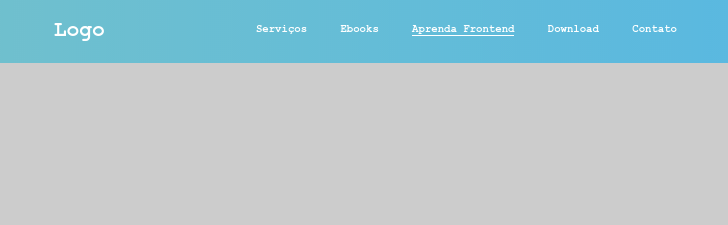
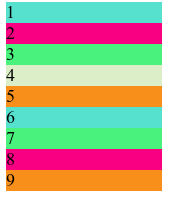
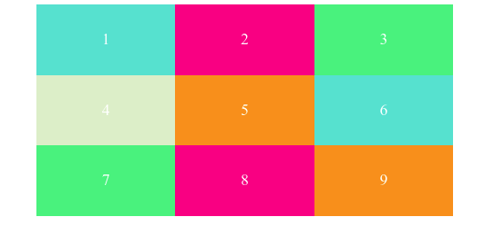

<h1>
    
Atividades

</h1>

<h3>
    1 - Flexbox Froggy
</h3>

Realize os 24 exercícios do 
    <a href="https://flexboxfroggy.com/">Flexbox Froggy</a>.

<h3>2 - Utilizando Flexbox no meu Menu</h3>

Nessa atividade vamos praticar um pouco mais sobre os conceitos de Flexbox.

<ol><strong>Exercícios</strong>
    <li>Centralizar o contêiner.</li>
    <li>Aplicar o display como flex.</li>
    <li>Alinhar tudo ao centro da coluna.</li>
    <li>Criar uma quebra de items com o flex-wrap (caso o dispositivo diminua de tela os items automaticamente deve ficar um embaixo do outro).</li>
    <li>Aplicar o gradient no background.</li>
    <li>Deixar o menu fixo e ocupando 100% de largura.</li>
    <li>Adicionar efeito hover</li>
</ol>

<ol>
    <strong>Propriedades auxiliares</strong>
    <li>Font-Family utilizada 'Courier New e monospace'.</li>
    <li>Remova os estilos padrão dos links das listas.</li>
    <li>Definir cor #fff no elemento h1.</li>
    <li>Exemplos de gradient você encontra nesse 
        <a href="https://uigradients.com/#MoonPurple">link</a>.</li>
    <li>Mudar a cor do link</li>
</ol>

    <strong>Exemplo de como deve ficar</strong>
    

<h3>3 - Posicionando o box no centro</h3>

   

       Nessa atividade vamos praticar um pouco mais sobre os conceitos de Flexbox:
    

    
    

        Posicionando o box no centro

    

	<ol>
        <li>Crie um elemento html div com a classe 'container'.</li>
        <li>Defina uma altura(vh) e uma largura(%) para a div container.</li>
        <li>Cria mais 9 elementos div dentro da div container.</li>
        <li>Defina uma largura.</li>
        <li>Adicione uma cor de fundo para cada div. Se repetir a cor, agrupe os seletores.</li>
        <li>Utilize flexbox para alinhar e centralizar os elementos.</li>
	</ol>
	<ol>
       <strong>Na sua folha de estilo, deve conter as seguintes propriedades:</strong>
        <li>height</li>
        <li>margin</li>
        <li>display</li>
        <li>flex-direction</li>
        <li>flex-wrap</li>
        <li>align-items</li>
        <li>justify-content</li>
        <li>padding</li>
        <li>width</li>
	</ol>
	<ul>
        <strong>Cores Utilizadas:</strong>
        <li>#65e1cf</li>
        <li>#ed5781</li>
        <li>#79e97d</li>
        <li>#dceec8</li>
        <li>#f58f2d</li>
	</ul>
	

